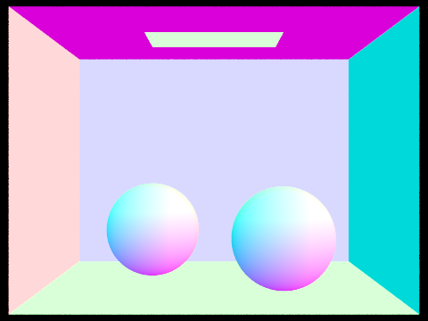
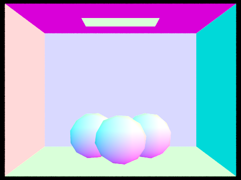

<meta http-equiv="content-type" content="text/html; charset=utf-8" />
<link rel="stylesheet" type="text/css" href="style.css" media="screen" />
<h1 align="middle">Path Tracer Write-up</h1>

  <h2 align="middle">Overview</h2>
   This is a cpu based path tracer that implements the core rendering loop from ray generation and intersection to global illumination. It has acceleration strategy like bounding volume hierachy and adaptive sampling and supports various materials, environment lighting and depth of field. Each core functionality is demonstrated in this writeup. This project builds upon the starter code of UC Berekeley CS184 Assignment 3.     
   
  <h2 align="middle">Part 1: Ray Generation and Scene Intersection</h2>

To compute the color information for each pixel we need to trace many rays to the scene and retrieve the information of the object surface that they intersects. 
For each pixel, we take random sample of position within the unit square, transform the sample point to camera space and parametrize a ray with this point and the origin. Then the ray in camera spacee is transformed to world space so that we can perform intersections.

In this project algorithms of ray intersection with triangle meshes and spheres are implemented. Ray triangle intersection is implemented with Moller Trumbore Algorithm that takes advantage of Barycentric coordinate *u*,*v* parameterization of intersection point within an triangle. Intersection points are within the tested triangle if *u*, *v*, *1-u-v* are all greater than zero.  Ray sphere intersection can be more obtained by finding the roots of quadratic equation of implicitly parametrizatized sphere and ray.
   
Besides the origin and direction value, we attach additional t_min and t_max values to ray object. These two values can accelerate intersection test by excluding the intersection points are outside of a ray's valid time range. Time ranges are updated every time a valid intersection with an object is found. 
    
 Below are results of intersection algorithm. Color visualized here represents the value of normal of the intersected surfaces.
 
    | |
   |-|-|
   Intersection with spheres in cornell box | Intersection with triangle meshes in cornell box|

