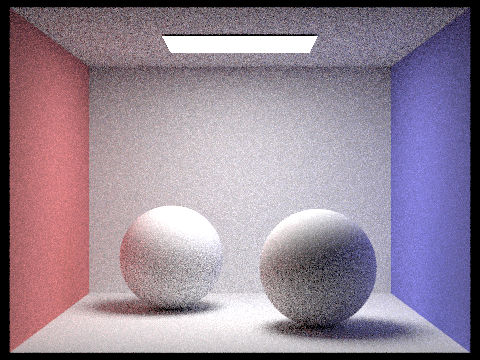

<meta http-equiv="content-type" content="text/html; charset=utf-8" />
<link rel="stylesheet" type="text/css" href="style.css" media="screen" />
<h1 align="middle">Path Tracer Write-up</h1>
All results tested on Macbook Pro 2.4 GHz Dual-Core Intel Core i5

  <h2 align="middle">Overview</h2>
   This is a cpu based path tracer that implements the core rendering loop from ray generation and intersection to global illumination. It has acceleration strategy like bounding volume hierachy and adaptive sampling and supports various materials, environment lighting and depth of field. Each core functionality is demonstrated in this writeup. This project builds upon the starter code of UC Berekeley CS184 Assignment 3. The features implemented in this path tracer are:

* Ray Generation and Scene Intersection
* Bounding Volume Hierarchy
* Direct Light Illumination
* Global Light Illumination
* Adaptive Sampling
* Mirror and Glass Material
* Microfacet Material
   
  <h2 align="middle">Part 1: Ray Generation and Scene Intersection</h2>

To compute the color information for each pixel we need to trace many rays to the scene and retrieve the information of the object surface that they intersects. 
For each pixel, we take random sample of position within the unit square, transform the sample point to camera space and parametrize a ray with this point and the origin. Then the ray in camera spacee is transformed to world space so that we can perform intersections.

In this project algorithms of ray intersection with triangle meshes and spheres are implemented. Ray triangle intersection is implemented with Moller Trumbore Algorithm that takes advantage of Barycentric coordinate *u*,*v* parameterization of intersection point within an triangle. Intersection points are within the tested triangle if *u*, *v*, *1-u-v* are all greater than zero.  Ray sphere intersection can be more obtained by finding the roots of quadratic equation of implicitly parametrizatized sphere and ray.
   
Besides the origin and direction value, we attach additional t_min and t_max values to ray object. These two values can accelerate intersection test by excluding the intersection points are outside of a ray's valid time range. Time ranges are updated every time a valid intersection with an object is found. 
    
 Below are results of intersection algorithm. Color visualized here represents the value of normal of the intersected surfaces.
 
    | |
   |-|-|
   Intersection with spheres in cornell box | Intersection with triangle meshes in cornell box|

  <h2 align="middle">Part 2: Bounding Volume Hierarchy</h2>
  
  Bounding volume hierarchy utilizes tree structures to accelerate ray scene intersection tests. At each level, geometric primitives are grouped into several bounding boxes, so that each ray can intersect bounding boxes first before intersecting the actual primitive. Here a simple median centroid heurstic is implemented to split the primitives. That is during the recursive construction of BVH, at each level of the tree, each primitive is partitioned into left node or right node based on the comparison between its centroid position and the median of all primitive centroids at this level. The intersection algorithm time complexity reduces roughly from O(N) to O(logN) where N is the number of primtives. 

  

Second level of BVH constructed on a Utah Teapot

Below are experiment results on two test meshes with output image size 800x600. The speed gain from BVH are dramatic. With logarithmic improvement on runtime,the Peter mesh on the left with ten times more triangle meshes than the cow mesh on the right have similar performance on runtime.  

 | |
|-|-|
0.158 s wth BVH| 0.182 s with BVH|
330 s without BVH | 36 s with BVH|

<h2 align="middle">Part 3: Direct Light Illumination</h2>
In this part I walk through implementation and result of direct hemisphere sampling and light importance sampling.

Here we split the lighting event into emissive component at the intersection point plus direct lighting from some light sources.

**total_radiance = zero_bounce_radiance + one_bounce_radiance**

Thus once the camera ray intersect something in the scene, a direction need to be chosen in order to cast a new ray and find the light sources.
In the case of hemisphere sampling, a direction is sampled from a unit hemisphere. In the case of light importance sampling, 
direction is set by directly connecting light sources and intersection point. Before the light source illuminance can be added, 
the ray casted from the intersection point also checks if there is something else between it and the light source. If no illuminance reaches that 
point and there is no emission, then a shadow is formed. So this ray is also called shadow ray.

Two test images below are rendered with 16 samples per pixel and 8 samples per light source. Notice that in the bunny scene, light importance sampling
direct lighting produces much less noisy image than than the hemisphere sampling. In the beast scene with directional light source only, the shadow ray
is not able to find the emitting light source with hemisphere sampling. Thus the image produced is all black.

|Hemisphere Sampling|Light Importance Sampling| 
|-|-|
|  | |
| | |

|images with different number of light rays|
|-|
| 1 light rays|
||
| 4 light rays|
||
| 16 light rays|
||
| 64 light rays|
||

<h2 align="middle">Part 4: Global Light Illumination</h2>

Global illummination is extended from direction illuminance by replacing one bounce radiance with at least one bounce radiance.  
This is a recursive evaluation of radiance by tracing light ray from both emitting and non-emitting sources including light reflected and refracted. 

**total_radiance = zero_bounce_radiance + at_least_one_bounce_radiance**

where 

**at_least_one_bounce_radiance = one_bounce_radiance + constant*at_least_one_bounce_radiance** 

The recursive ray tracing terminates either when the ray reaches a specified max depth or with a pre-defined probability called Ruassian-Roullete. 
Ruassian-Roullete termination offers an unbiased estimate of infinite dimensional integral of light radiance.

Below are results of global illumination with increasing number of ray samples. All all generated under the conditions light sample = 4, max_ray_depth = 5, Russian-Roullete = 0.75. As the sample number increases, we see a less noisy scene and a dramatic visual change that more closely matches the real physics.

|lambertian spheres in Cornell Box|
|-|
| 1 sample|
||
| 4 samples|
||
| 16 samples|
||
| 64 samples|
||
| 1024 samples|
||

In comparison, in the scene without global illumination , we see a hard shadow under sphere and a black ceiling because no direct light 
reaches there. 

<h2 align="middle">Part 5: Adaptive Sampling</h2>

Each pixel has different speed of converging to the real value. Thus as we sample camera rays at each pixel we can keep track of sum and sum of square in order to compute mean and variance and use z-test to check for convergence. If sample variance is within a fraction of sample mean, we can terminate sampling early and reduce computation cost.
In our experiment time to render the Cornell Box Sphere scene of size 480X360,  1024 samples per pixel, 4 samples per light are compared
|time with adaptive sampling|time without adaptive sampling|
|-|-|
|360 s|238 s|

<h2 align="middle">Part 6: Mirror and Glass Material </h2>

Before I only dealt with diffuse surface where radiance at each point is assumed be the sum of radiance from all directions under a hemisphere. Thus to trace a path at diffuse surface I need to sample a random direction. However at reflective and refractive surface, the path tracing direction need to follow physical laws like law of reflection and law of refraction. Glass material is a dielectric object where both reflection and refracion happens. I can then compute reflective coefficient R_theta that telss how much light is reflected with a approximation of Fresnel equaiton: Schilick's approximation. The refractive coefficient is just 1 - R_tehta. 

The test scene has one purely reflective sphere on the left and a glass sphere on the right. When ray depth is one, only the reflective surface with direct lighting can be seen, indirect lighting is not yet counted . When ray depth is 2, all the reflected scene shows up. But the refractive surface is still black because light refracted into the sphere need to bounce twice to go through the sphere. As the maximum ray depth increases, we can see that light ray that go through more than one bounce "escapes" and shines on the right wall.

All the test scenes are rendered with 128 samples/pixel and 4 samples/light

|Glass material results with different recursive ray depth|
|-|
| Ray depth 0 |
||
| Ray depth 1 |
||
| Ray depth 2|
||
| Ray depth 3|
||
| Ray depth 4|
||
| Ray depth 5|
||
| Ray depth 100|
||

<h2 align="middle">Part 7: Microfacet Material </h2>
|Gold dragon with increasing alpha|
|-|
||
||
||
||

|Copper Bunny with different sampling methods|
|-|-|
|||
|Cosine hemisphere sampling|Beckmann Importance Sampling|
