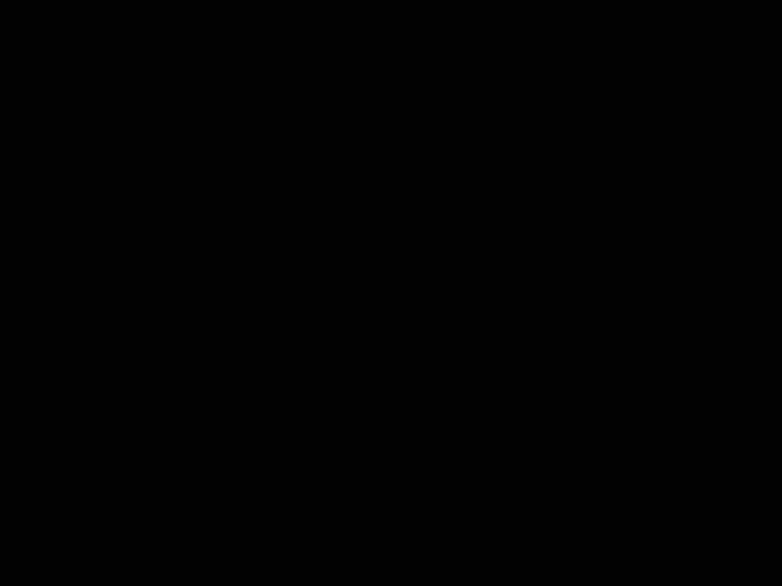

<meta http-equiv="content-type" content="text/html; charset=utf-8" />
<link rel="stylesheet" type="text/css" href="style.css" media="screen" />
<h1 align="middle">Path Tracer Write-up</h1>
All results tested on Macbook Pro 2.4 GHz Dual-Core Intel Core i5

  <h2 align="middle">Overview</h2>
   This is a cpu based path tracer that implements the core rendering loop from ray generation and intersection to global illumination. It has acceleration strategy like bounding volume hierachy and adaptive sampling and supports various materials, environment lighting and depth of field. Each core functionality is demonstrated in this writeup. This project builds upon the starter code of UC Berekeley CS184 Assignment 3.     
   
  <h2 align="middle">Part 1: Ray Generation and Scene Intersection</h2>

To compute the color information for each pixel we need to trace many rays to the scene and retrieve the information of the object surface that they intersects. 
For each pixel, we take random sample of position within the unit square, transform the sample point to camera space and parametrize a ray with this point and the origin. Then the ray in camera spacee is transformed to world space so that we can perform intersections.

In this project algorithms of ray intersection with triangle meshes and spheres are implemented. Ray triangle intersection is implemented with Moller Trumbore Algorithm that takes advantage of Barycentric coordinate *u*,*v* parameterization of intersection point within an triangle. Intersection points are within the tested triangle if *u*, *v*, *1-u-v* are all greater than zero.  Ray sphere intersection can be more obtained by finding the roots of quadratic equation of implicitly parametrizatized sphere and ray.
   
Besides the origin and direction value, we attach additional t_min and t_max values to ray object. These two values can accelerate intersection test by excluding the intersection points are outside of a ray's valid time range. Time ranges are updated every time a valid intersection with an object is found. 
    
 Below are results of intersection algorithm. Color visualized here represents the value of normal of the intersected surfaces.
 
    | |
   |-|-|
   Intersection with spheres in cornell box | Intersection with triangle meshes in cornell box|

  <h2 align="middle">Part 2: Bounding Volume Hierarchy</h2>
  
  Bounding volume hierarchy utilizes tree structures to accelerate ray scene intersection tests. At each level, geometric primitives are grouped into several bounding boxes, so that each ray can intersect bounding boxes first before intersecting the actual primitive. Here a simple median centroid heurstic is implemented to split the primitives. That is during the recursive construction of BVH, at each level of the tree, each primitive is partitioned into left node or right node based on the comparison between its centroid position and the median of all primitive centroids at this level. The intersection algorithm time complexity reduces roughly from O(N) to O(logN) where N is the number of primtives. 

  

Second level of BVH constructed on a Utah Teapot

Below are experiment results on two test meshes with output image size 800x600. The speed gain from BVH are dramatic. With logarithmic improvement on runtime,the Peter mesh on the left with ten times more triangle meshes than the cow mesh on the right have similar performance on runtime.  

 | |
|-|-|
0.158 s wth BVH| 0.182 s with BVH|
330 s without BVH | 36 s with BVH|

<h2 align="middle">Part 3: Direct Light Illumination</h2>
In this part I walk through implementation and result of direct hemisphere sampling and light importance sampling.

Here we assume that each pixel color is only the result of emissive component at the intersection point plus some direct lighting from some light sources.
** total_radiance = zero_bounce_radiance + one_bounce_radiance **
Thus once the camera ray intersect something in the scene, a direction need to be chosen in order to cast a new ray and find the light sources.
In the case of hemisphere sampling, a direction is sampled from a unit hemisphere. In the case of light importance sampling, 
direction is set by directly connecting light sources and intersection point. Before the light source illuminance can be added, 
the ray casted from the intersection point also checks if there is something else between it and the light source. If no illuminance reaches that 
point and there is no emission, then a shadow is formed. So this ray is also called shadow ray.

Two test images below are rendered with 16 samples per pixel and 8 samples per light source. Notice that in the bunny scene, light importance sampling
direct lighting produces much less noisy image than than the hemisphere sampling. In the beast scene with directional light source only, the shadow ray
is not able to find the emitting light source with hemisphere sampling. Thus the image produced is all black.

|Hemisphere Sampling|Light Importance Sampling| 
|-|-|
|  | |
| | |

|images with different number of light rays|
|-|
| 1 light rays|
||
| 4 light rays|
||
| 16 light rays|
||
| 64 light rays|
||

<h2 align="middle">Part 4: Global Light Illumination</h2>

Global illummination is extended from direction illuminance by replacing one bound radiance evaluated at light source 
recursive evaluation of radiance
